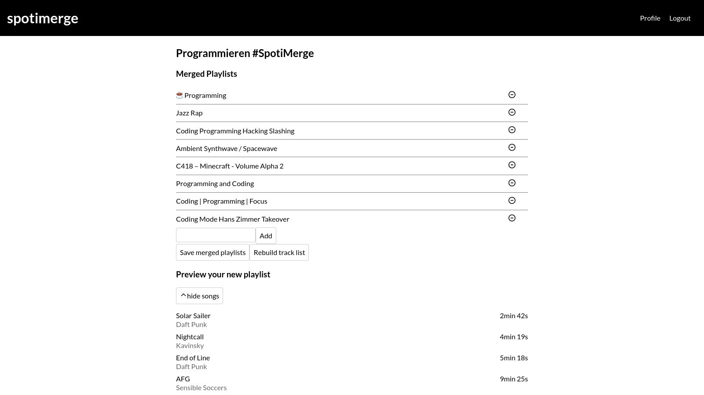

# `spotimerge-react`

`spotimerge-react` is a "spotimerge" implementation built in react, using 
[zustand](https://github.com/pmndrs/zustand) as state management.

spotimerge is a tool to merge multiple spotify playlists into a single 
playlist. If a playlist gets updated, you can visit spotimerge again and update
the songs in your `#SpotiMerge` playlist.

## Usage

You can use spotimerge-react under `spotimerge.craftam.app`.

## Development

`spotimerge-react` is built using [esbuild](https://github.com/evanw/esbuild),
using [@craftamap/esbuild-plugin-html](https://www.npmjs.com/package/@craftamap/esbuild-plugin-html)
as HTML plugin.

Use `yarn build` for building, `yarn watch` and `yarn serve` for development.
